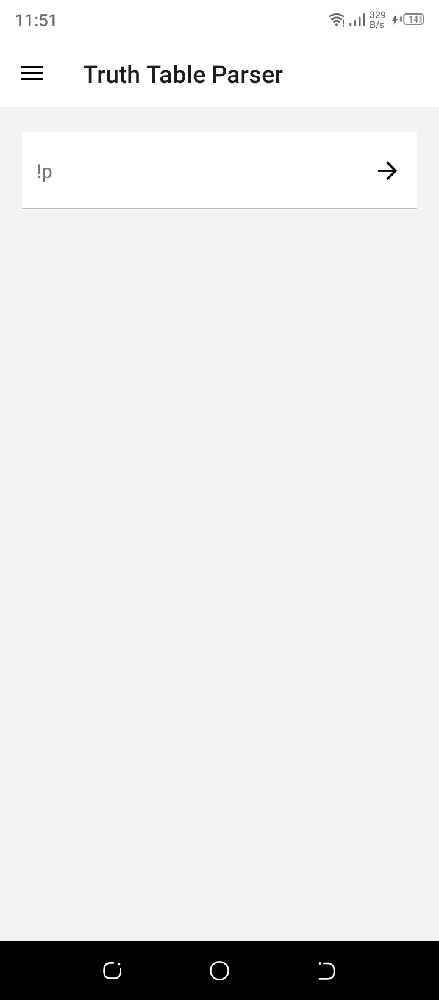
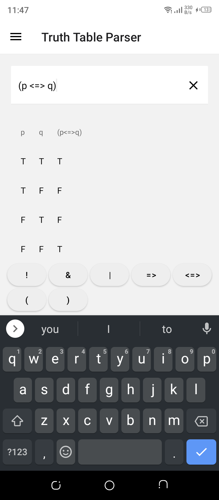
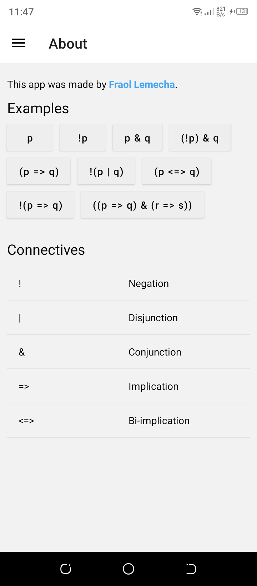

# ttp-app

An app that generates a truth table from a logical expression.
This app uses the TTP package from [here](https://github.com/frectonz/truth-table-parser).

## Live Example

If you have Expo Go installed on your device, you can run the app by using this link.

<https://expo.dev/@fraol/TTP>

## Screenshots

| 1 | 2 | 3 | 4 |
| -------- | -------- | -------- | -------- |
|  |  |  |  |
